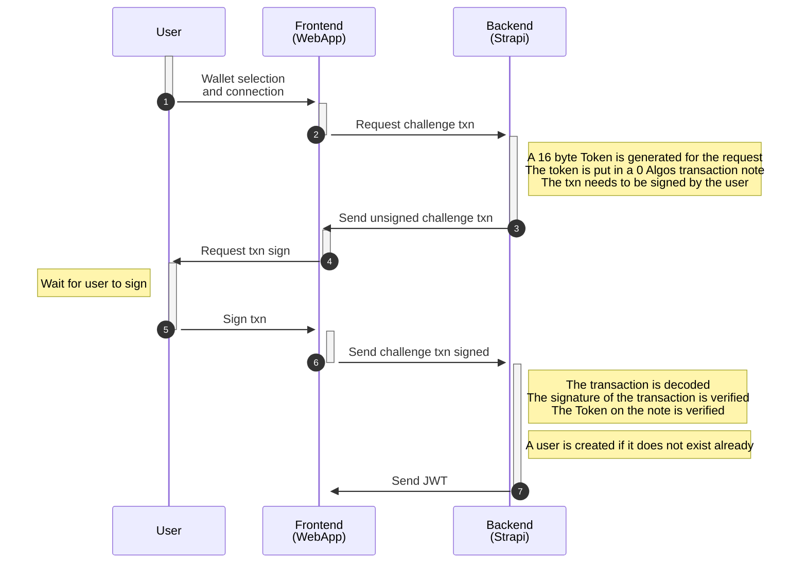
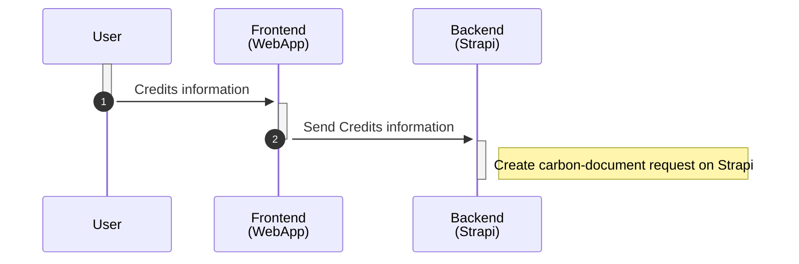
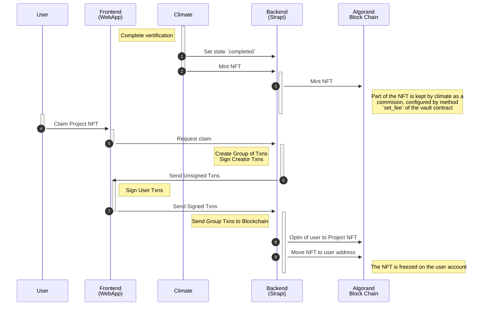
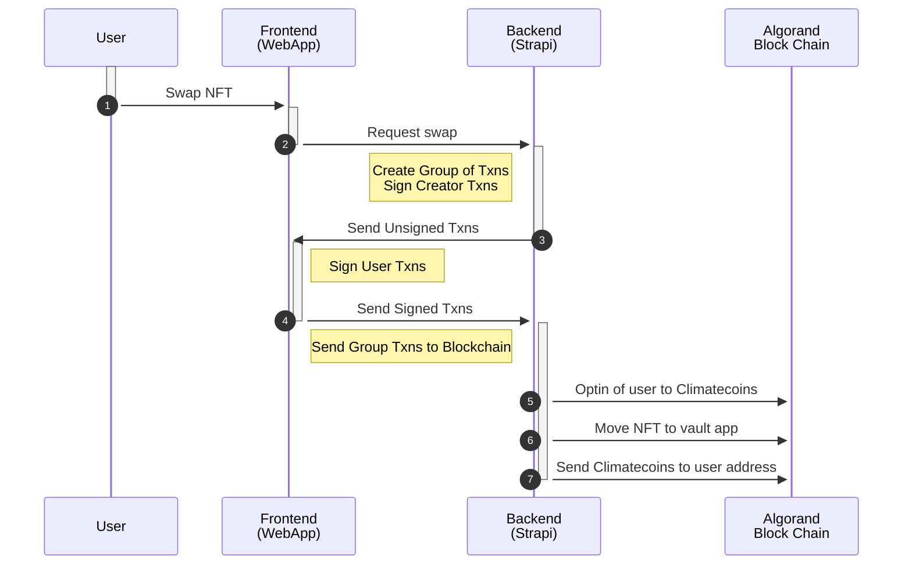
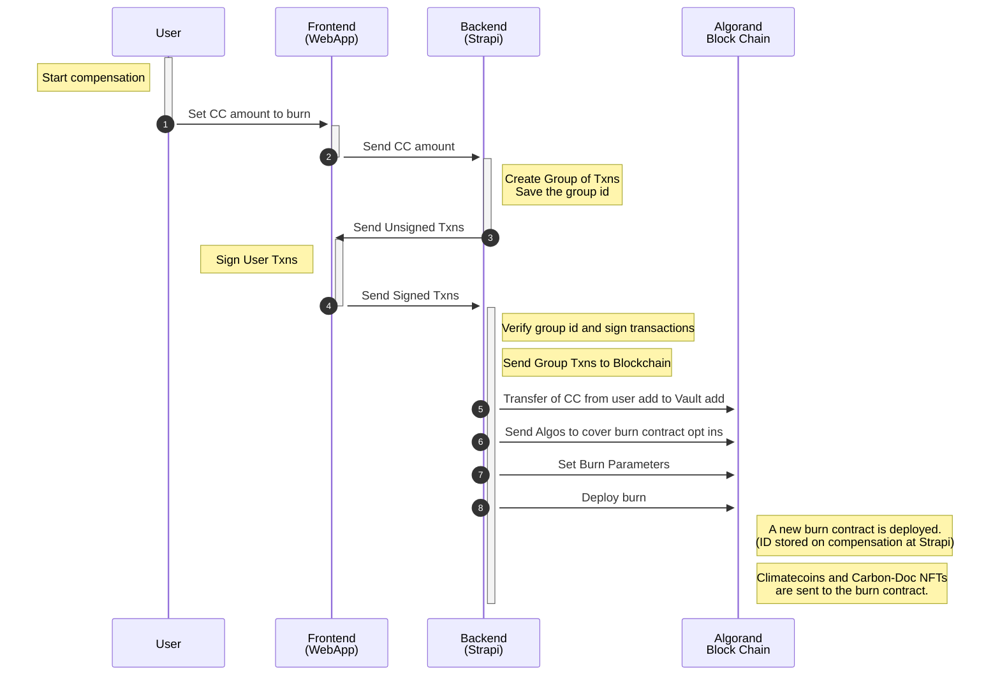
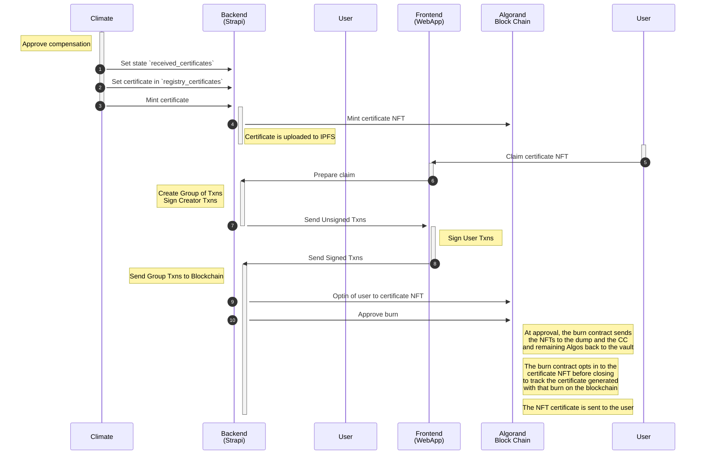
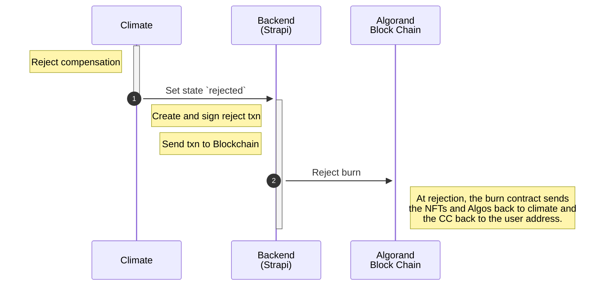

# climatecoin-backend

We use Strapi (https://strapi.io/) as CMS for ClimateCoin.

# How to install

* First, create MongoDB container executing:
  
  ```docker-compose up -d```

* Next, you must create your .env file copying .env.example file and make sure you use correct data in the following variables (data used when you created previous database):
  
  ```
  DATABASE_PORT=270127
  DATABASE_NAME=project
  DATABASE_USERNAME=guest
  DATABASE_PASSWORD=guest
  ```

* Then you can install project requirements:
  
  ```yarn```

* And finally, execute this command to start strapi:
  
  ```yarn develop```

* If all it is correct, you could navigate to http://localhost:1337/admin/ to see your strapi in action!

# Tests

```export DEBUG=nock.* && yarn test```

# Volumes

Create the volume on the server and mount it in `/opt/public/uploads`

# User authentication
>The authentication process for the users is handled by making them sign a challenge transaction and verifying it later.



# User wallet creation
>The backend will send 1 Algos to the user's wallet when they register on the app using Magiclink.
>This will enable their wallets to be able to use them in algorand blockchain.
>The amount given to the new user is configurable with the enviroment variable `ALGOS_TO_NEW_USER=1`

# Carbon-Document Workflow

## Creating the request
>The user submits all the information required in the form, and it is saved on Strapi.


## Credits received
>Climate has received the credits, carbon-document NFT will be issued


## Swap for Climatecoins
>The user swaps the project NFT to get Climatecoins
>>In this step, the frontend will automatically opt the user in to climatecoin if they have not opted-in already


# Compensation Workflow

## Creating the burn
>On this workflow the user creates a compensation request and sends the funds to a new burn deploy contract until it is revised. <br>
>At the moment of the creation of the group transactions (steps 2->3) the backend decides which carbon document NFTs will get burned if the transaction gets approved by climate. <br>
>>- The NFTs that get burned are selected by getting the oldest ones first, based on the field `credit_start` of the NFT.<br>
>>- A maximum of 5 NFTs can be burned at the same time due to Algorand limitations.<br>
>>- The moment the NFTs are selected, they get locked by the backend for (by default) 10 minutes. This prevents multiple users getting the same NFTs to burn. 
>>- The amount of minutes can be configured using an environment variable `MAX_MINUTES_TO_BURN=10`


## Approving the burn
>On this workflow climate has approved the compensation by:
>1. Updating the state of it to `received_certificates`
>2. Uploading the certificates to `registry_certificates`
>3. Minting the NFT
>
>The moment the NFT is minted, the burn contract is closed and approved.
>
>Once the compensation has been minted it cannot be undone.


## Rejecting the burn
>On this workflow climate has decided to reject the compensation request by:
>1. Updating the state of it to `rejected`
>
> The backend will automatically reject the burn in the blockchain, returning NFTs to Climate and CC to the user

