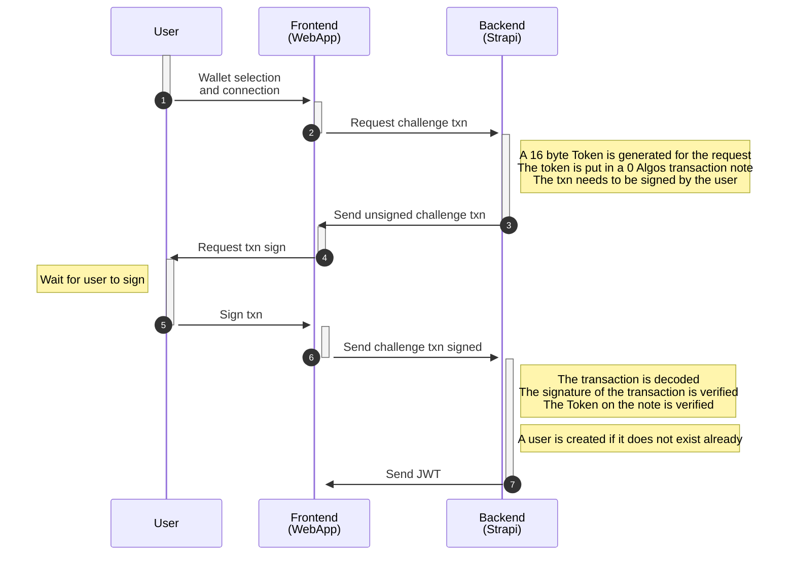

# Strapi plugin web3-auth

Authenticate users with any Algorand wallet

```mermaid
sequenceDiagram
participant Usr as User
participant Front as Frontend <br> (WebApp)
participant Back as Backend <br> (Strapi)
autonumber

    activate Usr
    Usr->>+Front: Wallet selection<br>and connection
    deactivate Usr

    activate Front
    Front->>+Back: Request challenge txn
    deactivate Front

    activate Back
    note right of Back: A 16 byte Token is generated for the request<br>The token is put in a 0 Algos transaction note<br>The txn needs to be signed by the user
    Back->>+Front: Send unsigned challenge txn
    deactivate Back 
    
    activate Front
    Front->>+Usr: Request txn sign
    deactivate Front
    
    activate Usr
    note left of Usr: Wait for user to sign
    Usr->>+Front: Sign txn
    deactivate Usr

    activate Front
    Front->>+Back: Send challenge txn signed
    deactivate Front

    activate Back
    note right of Back: The transaction is decoded<br>The signature of the transaction is verified<br>The Token on the note is verified
    note right of Back: A user is created if it does not exist already
    Back->>+Front: Send JWT
    deactivate Back 
```
